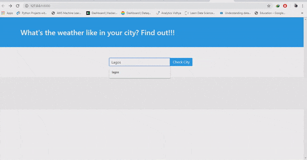

# WeatherApp built with django
This is a simple implementation to check current weather using <a href="https://openweathermap.org/">OpenWeatherMap</a> API

#### Project Quickstart
Clone repo 

Inside a virtual environment running Python 3:
- cd <-repo folder->
- `pip install -r requirement.txt`
- `./manage.py runserver` to run server.
- In your web browser enter the address : http://localhost:8000 or http://127.0.0.1:8000/

# Screenshots : 

